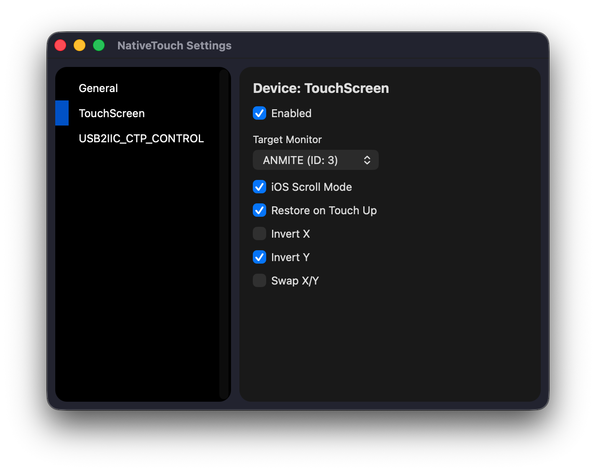
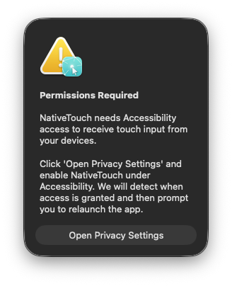
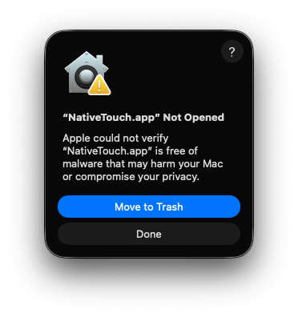
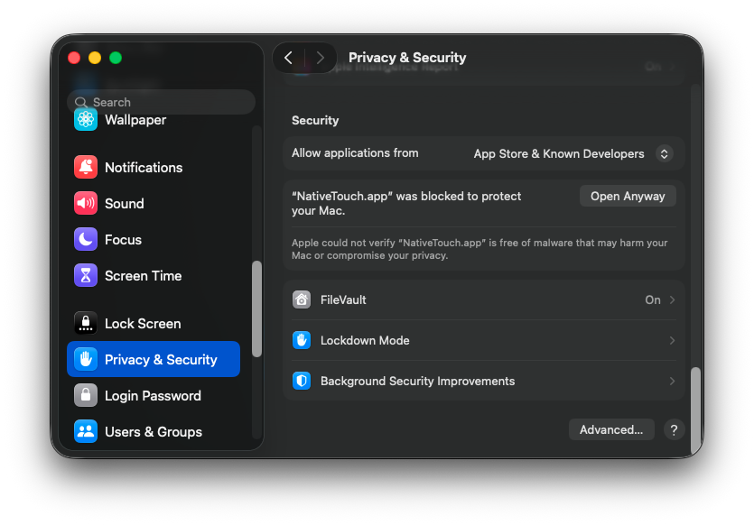

# NativeTouch

NativeTouch is a lightweight macOS utility that lets compatible touch screens and digitizers control your cursor in a predictable way.

Instead of built-in touch behavior that may feel noisy and inconsistent, NativeTouch maps touch input to pointer movement, clicks, dragging, and optional scrolling using a dedicated touchscreen profile.

## Features

- Auto-discover touch/digitizer devices and handle hot-plug connect/disconnect
- Per-device settings with menu bar status and quick enable/disable
- Target monitor selector (map touch to specific display)
- Normalized tap, drag, and click gestures
- Long-press for right-click behavior
- Optional scroll mode with momentum support
- Invert X/Y, swap axes, and restore cursor position on release
- Optional launch at login integration



## Supported Interactions

- Left click
- Right click (long press)
- Drag and cursor movement
- Scroll gestures from touch motion

## Limitations

- Not a general mouse emulator for every USB HID input
- Not designed for handwriting/pen pressure functionality
- Not a gesture ioctl layer (no pinch/zoom/two-finger Scroll) beyond the defined touch-to-pointer mapping

## Install NativeTouch (macOS)

1. Download latest zip from [releases](https://github.com/xperiments/NativeTouch/releases)
2. **Drag NativeTouch into your Applications folder.**
   > **Note:** This is a crucial step. Running the app from your Downloads folder can cause "Translocation" errors that break its functionality.


### First Time Launch

Because NativeTouch is an independent tool, macOS needs a quick "manual handshake" to trust it.

1.  Open the **Terminal** app.
2.  Paste the following command and press **Enter**:
    ```bash
    xattr -rd com.apple.quarantine /Applications/NativeTouch.app
    ```
3.  Go to your **Applications** folder.
4.  **Right-click** NativeTouch and select **Open**.
5.  Click **Open** one last time on the popup.

### Granting Permissions



Once the app starts, you will see a request for **Accessibility Access**. This is required so the app can convert your device's touch data into mouse movements.

1.  Click **Open Privacy Settings** in the popup.
2.  In the window that opens, find **NativeTouch** in the list.
3.  **Toggle the switch to ON** (you may need to enter your Mac password).
4.  NativeTouch will detect the change and prompt you to **Relaunch**. 

**Success!** The app is now ready to use.

### ⚡ Troubleshooting: "App won't open"



If the app still refuses to launch after Step 2:
1.  Go to **System Settings → Privacy & Security**.
2.  Scroll down to the **Security** section.
3.  Look for a message saying "NativeTouch was blocked" and click **Open Anyway**.



## License

MIT License

Copyright (c) 2026 Pedro Casaubon

Permission is hereby granted, free of charge, to any person obtaining a copy
of this software and associated documentation files (the "Software"), to deal
in the Software without restriction, including without limitation the rights
to use, copy, modify, merge, publish, distribute, sublicense, and/or sell
copies of the Software, and to permit persons to whom the Software is
furnished to do so, subject to the following conditions:

The above copyright notice and this permission notice shall be included in all
copies or substantial portions of the Software.

THE SOFTWARE IS PROVIDED "AS IS", WITHOUT WARRANTY OF ANY KIND, EXPRESS OR
IMPLIED, INCLUDING BUT NOT LIMITED TO THE WARRANTIES OF MERCHANTABILITY,
FITNESS FOR A PARTICULAR PURPOSE AND NONINFRINGEMENT. IN NO EVENT SHALL THE
AUTHORS OR COPYRIGHT HOLDERS BE LIABLE FOR ANY CLAIM, DAMAGES OR OTHER
LIABILITY, WHETHER IN AN ACTION OF CONTRACT, TORT OR OTHERWISE, ARISING FROM,
OUT OF OR IN CONNECTION WITH THE SOFTWARE OR THE USE OR OTHER DEALINGS IN THE
SOFTWARE.

